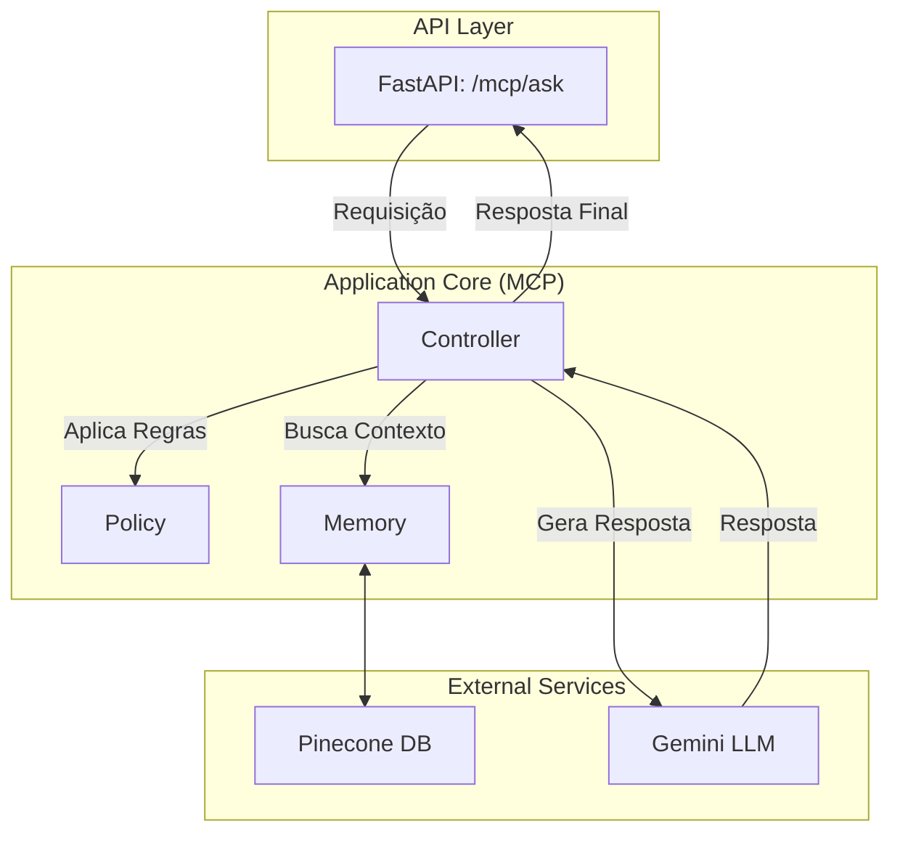

# Projeto de RAG com Arquitetura MCP

Aplicação de Busca Aumentada por Geração (RAG) para consulta de documentos, reestruturada com a arquitetura **Memory, Controller, Policy (MCP)** para maior clareza, manutenibilidade e escalabilidade.

## Relatório de Melhorias: Da Arquitetura Inicial para MCP

### 1. Estado Inicial do Projeto

O projeto inicial já era funcional e implementava um fluxo RAG básico. No entanto, a arquitetura apresentava os seguintes desafios:
- **Alto Acoplamento:** A lógica de negócio, as chamadas à API do Pinecone e a formatação de prompts para o LLM estavam misturadas nos mesmos arquivos de rota da API (ex: `llm_router.py`).
- **Dificuldade de Manutenção:** Qualquer alteração, como a troca do modelo de embedding ou a adição de uma nova regra de negócio, exigiria modificar múltiplos arquivos e funções interligadas.
- **Baixa Escalabilidade:** Adicionar novos fluxos, como um histórico de conversas ou regras de acesso mais complexas, seria complicado e tornaria o código progressivamente mais confuso.

### 2. Solução Implementada (Arquitetura MCP)

Para resolver esses desafios, o projeto foi refatorado para adotar o padrão de arquitetura **Memory, Controller, Policy (MCP)**, que separa claramente as responsabilidades do sistema.

**Componentes da Arquitetura MCP:**

- **`Memory` (Memória):**
  - **Responsabilidade:** Gerenciar o estado e o conhecimento de longo prazo do sistema.
  - **Implementação:** A pasta `memory/` e o arquivo `pinecone_memory.py` agora centralizam toda a interação com o banco de dados vetorial (Pinecone). Qualquer operação de busca ou salvamento de documentos passa por esta camada.

- **`Policy` (Política):**
  - **Responsabilidade:** Aplicar regras de negócio, validações e restrições.
  - **Implementação:** A pasta `policy/` e o arquivo `policy.py` contêm a lógica para validar perguntas, filtrar resultados com base em score de relevância, ou aplicar quaisquer outras regras de negócio (ex: anonimização de dados, controle de acesso).

- **`Controller` (Controlador):**
  - **Responsabilidade:** Orquestrar todo o fluxo de uma requisição. Ele atua como o "cérebro" da operação.
  - **Implementação:** A pasta `controller/` e o arquivo `controller.py` recebem a requisição, utilizam a `Memory` para buscar o contexto, aplicam as regras da `Policy` e, finalmente, montam o prompt e chamam o LLM (Gemini) para gerar a resposta.

### 3. Principais Vantagens da Nova Arquitetura

1.  **Separação de Responsabilidades:** Cada componente tem um único trabalho, tornando o código mais limpo e fácil de entender.
2.  **Facilidade de Manutenção:** Precisa trocar o Pinecone por outro banco vetorial? Modifique apenas a camada de `Memory`. Quer adicionar novas regras de negócio? Trabalhe apenas na camada de `Policy`.
3.  **Escalabilidade:** É simples adicionar novas funcionalidades. Por exemplo, para implementar um histórico de conversas, basta expandir a camada de `Memory` e ajustar o `Controller` para usá-lo.
4.  **Testabilidade:** Cada camada (Memory, Controller, Policy) pode ser testada de forma isolada, garantindo maior qualidade e confiabilidade do código.

## Diagrama da Nova Arquitetura



## Como Configurar e Rodar o Projeto

### Pré-requisitos
- Python 3.9+
- Conta no Pinecone
- Chave de API da Google (Gemini)

### 1. Crie o Ambiente Virtual
```bash
python -m venv venv
```

### 2. Ative o Ambiente Virtual
- **Windows (PowerShell):**
  ```powershell
  .\venv\Scripts\activate
  ```
- **Linux/macOS:**
  ```bash
  source venv/bin/activate
  ```

### 3. Instale as Dependências
```bash
pip install -r requirements.txt
```

### 4. Configure as Variáveis de Ambiente
- Renomeie o arquivo `.env.example` para `.env`.
- Abra o arquivo `.env` e preencha com suas chaves de API:
  ```
  PINECONE_API_KEY="SUA_CHAVE_PINECONE"
  PINECONE_HOST="SEU_HOST_PINECONE"
  PINECONE_INDEX_NAME="brito-ai"
  GEMINI_API_KEY="SUA_CHAVE_GEMINI"
  ```
### 5. Rodar o Back-End
```bash
uvicorn api_mcp:app --reload --host 0.0.0.0 --port 8000
```
### 6. Rodar o Front-End
```bash
cd frontend
npm run dev
```
### 7. Rode o Servidor da API
```bash
uvicorn api_mcp:app --reload
```
O servidor estará disponível em `http://127.0.0.1:8000/docs`.

## Como Usar a API

1.  Acesse a documentação interativa no seu navegador: **[http://127.0.0.1:8000/docs](http://127.0.0.1:8000/docs)**.
2.  Encontre o endpoint `POST /mcp/ask`.
3.  Clique em "Try it out".
4.  Preencha o corpo da requisição com sua pergunta. Exemplo:
    ```json
    {
      "pergunta": "Quais são as principais cláusulas do contrato de aluguel?",
      "max_results": 3
    }
    ```
5.  Clique em "Execute" para ver a resposta gerada pelo sistema.
